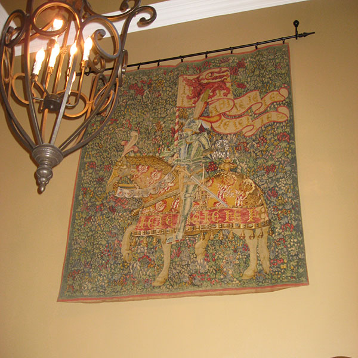

## Nullify Image Perspective

### A fun illustration of affine transform and bilinear interpolation

Given a photograph taken off-axis of a planar subject, we can reverse the perspective effect of the camera angle and display the subject without the geometric distortions due to perspective.

<table border="0" style="width:80%;border:0px"> <tr style="border:0px">
    <td style="width:50%;border:0px">
        
    </td>
    <td style="width:50%;border:0px">
        
    </td>
</tr> </table>

This repository discusses and demonstrates how this is done. The presentation <b>perspective.ipynb</b> is in the form of an IPython Notebook, which allows a user to modify parameters and to apply the code to his own data. Its interactive features are available, only if the IPython Notebook App and a suitable Python development environment have been installed. Installing Anaconda is an excellent way to prepare a system for Python coding and for using IPython Notebooks. Anaconda is a completely free Python distribution for scientific purposes. It manages the installation of optional packages and can even do so for multiple configuration environments. Anaconda can be downloaded at http://continuum.io/downloads. 

A static html copy of the presentation is also included.

#### Source
This problem was one of the many fun labs in the course <em>Coding the Matrix: Linear Algebra through Computer Science Applications</em>, offered on Coursera by Prof. Philip Klein of Brown University. While the main approach used here of solving a system of nine linear equations to realize an appropriate change of basis is as presented in that class, the execution is quite different. To excellent pedagogic effect, Prof. Klein created special vector and matrix classes for which we wrote our own operation and solver routines. We also used an unconventional image data structure, where the pixels are not necessarily square (or even rectangular) but lie on a grid of not-necessarily parallel lines. For this IPython Notebook presentation, on the other hand, in order to communicate to a general audience, I employ only ordinary data structures from standard packages, particularly <em>numpy</em>. Consequently, future students of Prof. Klein's class will not find any code that they can lift from this notebook to complete their lab assignments.